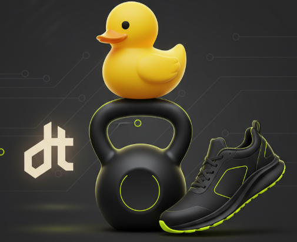
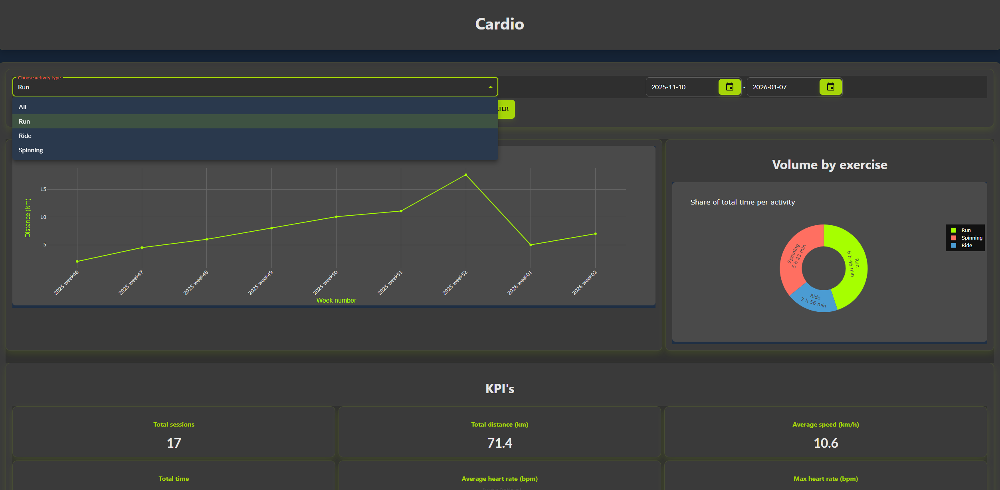
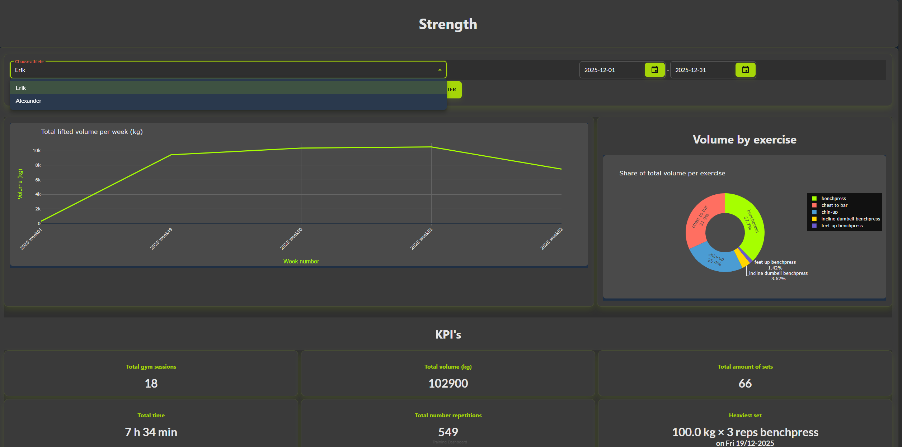

# Training Dashboard - Data Engineering Project

Detta projekt är en komplett datapipeline och dashboard för insamling, lagring och analys av personlig träningsdata. Projektet kombinerar styrketräningsdata från Google Sheets med konditionsträningsdata från Strava (kopplat till Garmin-klocka) och lagrar all data i en gemensam DuckDB-databas. Data modelleras med dbt och visualiseras i en interaktiv Taipy-dashboard.

---

## Funktioner

- Automatisk inhämtning av träningsdata från Strava API och Google Sheets
- Datatransformation och modellering med dbt för robusta och återanvändbara datamodeller
- Interaktiv dashboard byggd med Taipy för analys av träningsvolym, intensitet och utveckling över tid
- Containeriserad lösning som kan köras lokalt eller i molnet (Azure)
- Anpassad CSS för förbättrad användarupplevelse i dashboarden

---

## Teknisk översikt

- **Databas:** DuckDB (filbaserad, snabb analytisk databas)
- **Datamodellering:** dbt Core
- **Dataingest:** Python-skript med dlt för Strava och Google Sheets
- **Orkestrering:** Dagster (för pipeline-körningar)
- **Dashboard:** Taipy GUI
- **Molndrift:** Azure Container Instances, Azure Web App, Docker 


---

## Kom igång

### Förutsättningar

- Tillgång till Strava API-nycklar och Google Sheets (fås via projektansvarig)

### Steg för lokal körning

1. Installera beroenden:
   ```bash
   pip install -r requirements.txt
   ```
2. Starta Dagster UI:
    ```bash
    dagster dev -f dagster_strength.py -h 0.0.0.0 -p 3000
    ```
    och materialisera modellerna.
3. Kör dashboard lokalt:
    ```bash
    cd frontend
    python dashboard.py
    ```

### Utforska Dashboarden online

Dashboarden är även tillgänglig online via följande URL:
https://training-dashboard-de24-etf8b0g7hsavegb3.swedencentral-01.azurewebsites.net/dashboard


### Screenshot från Cardiosidan


### Screenshot från Strengthsidan


### Framtida utveckling
- Utöka datamodellen med fler dimensioner (t.ex. utrustning, geografiska platser)
- Integrera fler datakällor (t.ex. sömn, återhämtning)
- Förbättra skalbarhet för fler användare och större datamängder